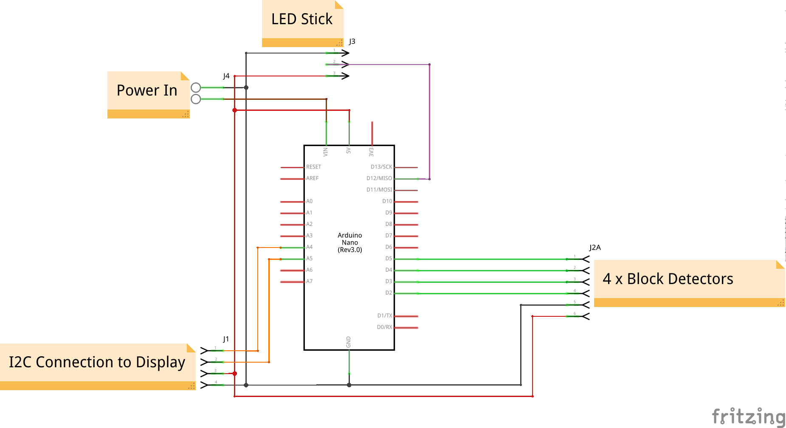

# Train Movement Measurer - The Electronics (Block Variation)

The heart of the project is an Arduino Nano where our code runs, this can be powered by the onboard USB or through the screw terminal (J4) which connects to the Arduino's Vin (accepting 7-12V DC, this circuit requires upto 500mA). It uses an OLED display (connected using I2C to J1) and an optional strip of WS2812 LEDs for output (connected to wires soldered to the breadboard, J3 in the schematic).

Input for timing trains comes from four block occupancy detectors which detect when a train is in a section of the track. Since the interfacing electronics is dependent on your detection method you'll need to design this part for yourself. Try to keep to using Arduino pins 6-2 for blocks 0-4.

## Parts List

* 1 x Half size solderable breadboard
* 1 x Arduino Nano
* 2 x 15x1 Female PCB headers (for Arduino Nano)
* 1 x 4x1 Female PCB header (for display)
* 1 x I2C OLED 128x64 or 128x32
* 1 x NeoPixel Stick (or other shape, at least 8 LEDs)
* 1 x 2 way 2.54mm screw terminal (if external power required)

## Assembly

As always with assembling electronics it's best to go in height order (shortest components to tallest). Note that the wires on the Arduino are actually wired underneath, their just shown there to make where to put them visible. When attaching the headers solder only one pin first then make sure it's sitting square to the board before soldering the rest.

### The breadboard

Start by aligning your solder breadboard as shown by the main board (A1 bottom left and J30 top right).
1. Solder wires between the following pairs of holes:
    * Both blue rails
    * Both red rails
    * A16 - Red rail
    * A18 - Blue rail
    * J4 - Blue rail
    * If you're fitting the power connector:
      * E18 - F20
      * E19 - F21
    * For the screen (note you may need to adjust these based on your screen's size and pinout):
      * C12 - C27
      * D13 - D26
      * A24 - Blue rail
      * A25 - Red rail
2. Solder the screw terminal (if fitting the power connector) to I20-I21
3. Solder the 4x1 header for the screen
4. Solder the 15x1 headers to B5-B19 and F5-F19
