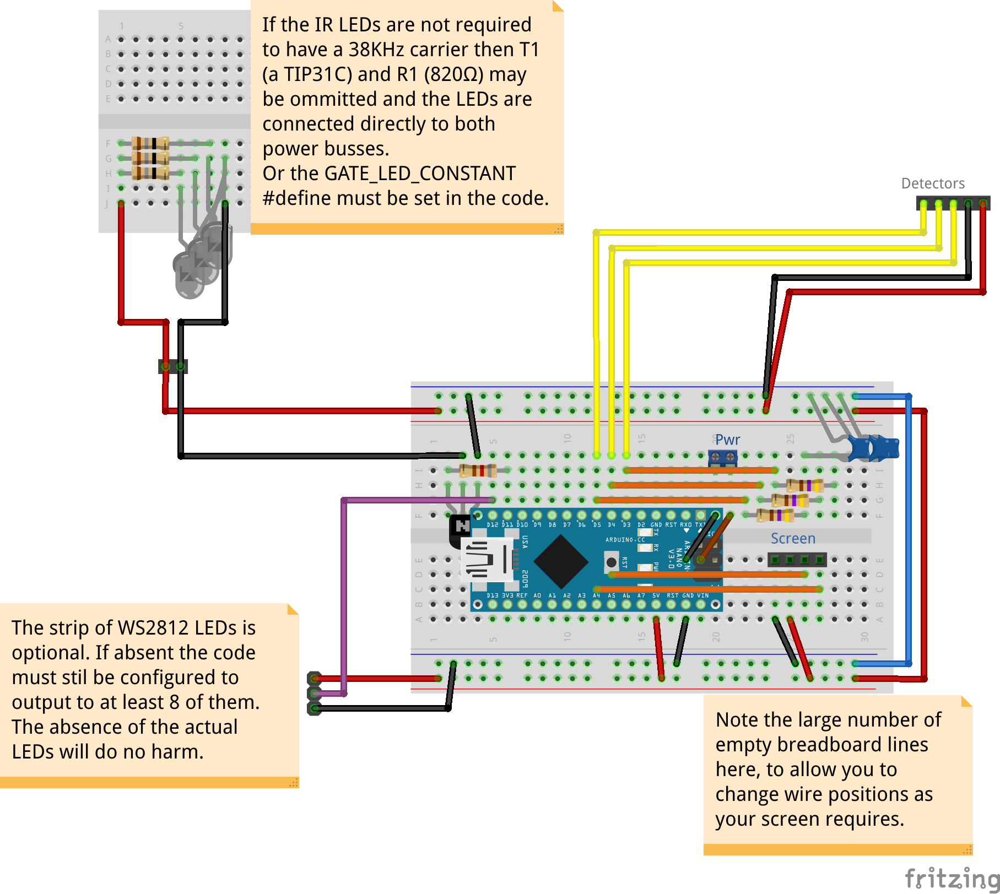

# Train Movement Measurer - The Electronics (Light Gate Variation)

The heart of the project is an Arduino Nano where our code runs, this can be powered by the onboard USB or through the screw terminal (J4) which connects to the Arduino's Vin (accepting 7-12V DC, this circuit requires upto 500mA). It uses an OLED display (connected using I2C to J1) and an optional strip of WS2812 LEDs for output (connected to wires soldered to the breadboard, J3 in the schematic).

Input for timing trains comes from three light gates using the IR LEDs and detectors. The LEDs are controlled via a transistor to allow them to be flashed at 38KHz. The detectors are connected to the Arduino via a simple RC filter to smooth out the occasional erroneous low reading.
The RC filters work by charging the capacitor whilst the detector's output is high, when the output goes low the capacitor discharges through the resistor keeping the signal to the Arduino high for around 0.15ms. Whilst this does introduce a delay in detection since it's the same delay at each gate and it's the difference we're interested in the delay doesn't matter for our purpose.

## Parts List

* 1 x Half size solderable breadboard
* 1 x Arduino Nano
* 2 x 15x1 Female PCB headers (for Arduino Nano)
* 1 x 4x1 Female PCB header (for display)
* 1 x I2C OLED 128x64 or 128x32
* 1 x NeoPixel Stick (or other shape, at least 8 LEDs)
* 1 x TIP31C NPN transistor (T1)
* 1 x 820Ω 0.6W resistor (R1)
* 3 x 18Ω 1W resistor (R5, R6, R7)
* 3 x 950nm IR LED (TSUS5202)
* 3 x 470Ω 0.6W resistor (R2, R3, R4)
* 3 X 470nF capacitor (C1, C2, C3)
* 3 x TSSP4038 IR receiver
* 1 x 2 way 2.54mm screw terminal (if external power required)

## Assembly

As always with assembling electronics it's best to go in height order (shortest components to tallest). Note that the wires on the Arduino are actually wired underneath, their just shown there to make where to put them visible. When attaching the headers solder only one pin first then make sure it's sitting square to the board before soldering the rest.

### The breadboard

Start by aligning your solder breadboard as shown by the main board (A1 bottom left and J30 top right).
1. Solder wires between the following pairs of holes:
    * Both blue rails
    * Both red rails
    * A16 - Red rail
    * A18 - Blue rail
    * J4 - Blue rail
    * If you're fitting the power connector:
      * E18 - F20
      * E19 - F21
    * For the screen (note you may need to adjust these based on your screen's size and pinout):
      * C12 - C27
      * D13 - D26
      * A24 - Blue rail
      * A25 - Red rail
    * Be careful to allow enough space for the power connector if you're fitting it:
      * I14 - I24
      * H13 - H23
      * G12 - G22
2. Solder the resistors:
    * R1 (820Ω) between I2 and I6
    * R2 (470Ω) between F22 and F26
    * R3 (470Ω) between G23 and G27
    * R4 (470Ω) between H24 and H28
3. Solder the capacitors:
    * C1 (470nF) between J26 and blue rail
    * C2 (470nF) between J27 and blue rail
    * C3 (470nF) between J28 and blue rail
4. Solder the transistor making sure that the metallic side way from the Arduino.
5. Solder the screw terminal (if fitting the power connector) to I20-I21
6. Solder the 4x1 header for the screen
7. Solder the 15x1 headers to B5-B19 and F5-F19

### The light gate LEDs

Assuming that you've built the tunnel as described in [the tunnel readme](../Tunnel/README.md), if not then you'll need to adjust these instructions to suit what you have. Whilst you can't check if the LED is lit by looking at it the camera in your smart phone can. You should be working on the side which is furthest from the wire hole on the top piece and closest to the holes for the LED strip.

1. Attach R5 to the positive lead of LED1 (electrically the negative side works too). Repeat for R6 to LED2 and R7 to LED3. You'll probably need to trim the leads before hand to make the LED + resistor combinations fit.
2. Temporarily mount one of the side LEDs into it's hole with the resistor towards the top and the other lead towards the bottom.
3. Solder one end of some bare wire to the resistor, unroll it al the way to the other end of the side and trim. Do the same for the negative lead.
4. Now mount the LED at the other end and solder to the bare wires, these should now be trimmed for a neat finish.
5. Now mount the middle LED and solder to the bare wires.
6. Attach the red wire (colour doesn't actually matter but I'll be referring to it as red later) to the positive bare wire it should route to the other side of the tunnel.
7. Attach the white wire (colour doesn't actually matter but I'll be referring to it as white later), to the negative bare wire it should route to the top of the tunnel.
8. The LEDs should be a snug fit into the holes but a dab of glue applied to each will keep them where they are.

### The light gate detectors

Assuming that you've built the tunnel as described in [the tunnel readme](../Tunnel/README.md), if not then you'll need to adjust these instructions to suit what you have. You should be working on the side which is closest to the wire hole on the top piece and furthest from the holes for the LED strip. Make sure to understand which pins of the detector are +ve, gnd and signal.

1. Using the bare wire "trick" used for the LEDs attach all the positive and ground pins together.
2. The signal pins should be attached to different coloured wires and routed to the top of the tunnel.
3. Attach the black wire (colour doesn't actually matter but I'll be referring to it as black later) to the ground bare wire it should route to the top of the tunnel.
4. Attach the red wire from the top of the tunnel (colour doesn't actually matter but I'll be referring to it as red later) to the positive bare wire.
5. Attach the red wire from the other side of the tunnel to the positive bare wire.
6. I had trouble securing these with glue and so their taped in place on mine.

### Connecting the LEDs and detectors

If you have followed the instructions above you'll have a tunnel with a red, a black, a white and three different coloured wires appearing out the top.

1. Solder the red wire (or whatever goes to the positive of both sides) to a red rail on the breadboard.
2. Solder the black wire (or whatever goes to the ground of the detector side) to a blue rail on the breadboard.
3. Solder the white wire (or whatever goes to the negative of the LED side) to J3.
4. Solder the signal wire for the detector furthest from the breadboard to J12.
5. Solder the signal wire for the middle detector to J13.
6. Solder the signal wire for the detector closest to the breadboard to J14.
