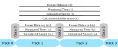

# Train Movement Measurer

This is a project to to measure the scale speed and acceleration of a model train moving along a piece of straight track. I hope I've managed to document it such that someone just starting out with their [Arduino](https://www.arduino.cc/) adventure can follow along and create their own. If you're not a beginner you'll likely want to skim through rather than completely read this readme.

[Why?](#why)\
[The Physics & Maths](#the-physics-maths)\
[The Electronics](#the-electronics)\
[The Tunnel](#the-tunnel)\
[Options](#options)

---

## Why?

By measuring the scale speed of a train you're able to more easily speed match across a fleet of [DCC](https://wikipedia.org/wiki/Digital_Command_Control "Digital Command Control on Wikipedia") equipped locomotives, or learn what a realistic running speed looks like. By also measuring acceleration you're able to automate the speed matching (if you're feeling adventurous) by only paying attention to readings once the train has clearly reached the desired speed step or learn how not to make your passengers spill their coffee.

## The Physics & Maths

We're going to assume that the track is a 20cm long straight length (curves are possible you just need to be careful with measuring how far the train travels between different triggers - the maths is then the same). Physicists normally love simplifying things down to spheres in a vacuum, however for us it's simpler to consider our train to be a solid cube travelling along a straight line (our track). The fact the front of our train isn't exactly a cube doesn't matter as assuming the triggers are all at the same height above the rail the same part of the train will trigger each of them.

As we learnt and school speed is calculated by dividing distance travelled by time taken.\
_s = d ÷ t_\
To keep things simple we'll stick to metric so we end up with a measurement in m/s (meters per second). Since we know the distance between our triggers it's as simple is timing how long elapses between two triggers being triggered.
In the same way as speed measures the rate at which distance changes acceleration measures the rate at which speed changes, since we're working in metric this is in meters per second per second or m/s² (in the following formula Δ represents the change in a value).\
_a = Δs ÷ t_\
At this point we can do some conversions to get from m/s and m/s² into something a bit more meaningful:
* To get Km/h or Km/h/s multiply by 3.6 × scale
* To get mph or mph/s multiply by 2.236936 × scale

Now we now the basics, let's discover how to use three detectors to measure three speeds and one acceleration:\
d₁ is the distance between the first two triggers.\
d₂ is the distance between the last two triggers.\
d is the total distance (_d₁ + d₂_).\
t₁ is the time between the first two triggers.\
t₂ is the time between the last two triggers.\
t is the total time (_t₁ + t₂_).\
s₁ is the speed between the first two triggers.\
s₂ is the speed between the last two triggers.\
s is the speed between the first and last detector.\
a is the acceleration between the first and last  detector.

From the above we can easily calculate our speeds using:\
_s₁ = d₁ ÷ t₁_\
_s₂ = d₂ ÷ t₂_\
_s = d ÷ t_\
From here we have to understand that if the train is accelerating at a constant rate (which we're going to assume it is to keep things simple) then the speeds s₁ and s₂ occur at the times ½t₁ and ½t₂ (that is to say half way through each gap between detectors). We can therefore calculate the speed change and acceleration using:\
_Δs = s₂ - s₁_\
_a = Δs ÷ ½t_

## The Electronics

The electronics are rather simple 3 sets of IR LEDs are shone across the track into 3 IR Detectors. The LEDs are flashed at 38KHz by the Arduino, using a transistor to do the switching as the Arduino can not source enough current itself. The output from the detectors are filtered by a resistor and capacitor each in order to prevent a transient false "no IR signal" being detected by the Arduino. An OLED display and NeoPixel LED stick are directly connected to the Arduino for displaying the current state and readings.
See [Electronics/README.md](Electronics/README.md).

## The Tunnel

To hold the light gates a fixed distance apart I had some acrylic LASER cut, in order to make sure it fit together first time I actually used some 3D printing CAD software to create the parts. As a result you have the option of using either a 3D printer of LASER cutter to create the tunnel (see [Tunnel/README.md](Tunnel/README.md)). Or you can go and create your own mounting method.

## The Code

The code may need some changes before you compile and upload it to the Arduino. If you've built this exactly as described the documentation for the project you should only need to change one line (which tells the Arduino what scale to use). If you've kept the electronics the same but changed how far apart the light gates are you'll need to make 2 more changes. There are some other things you can tweak in the code such as how long the results are displayed on the screen for, additionally I'd like some more logo options. Depending on your display you may need to make some more changes (probably the I2C address). You can also easily change the number of LEDs in the strip should for example you want to use a semi circle or longer stick with more LEDs - in which case you'll want to change the list of colours and what speeds they light for the LEDs. The code provides some test modes which can be used to troubleshoot the hardware, see the comments in the code for further details.

The code goes through a number of steps when the Arduino receives power:
1. **Setup** - The Arduino gets itself and he screen up and going.
2. **Check** - That the sensors are clear, if not you'll get an error and the display and LEDs will be used to show you which sensors are clear/blocked.
3. **Wait For the light gate at either end to be blocked** - We save when this happened, since we know what direction the train is travelling in we keep track of what the exiting light gate will be too. The LEDs are used to show the direction of travel and that the first time has been saved.
4. **Wait for the middle light gate to be blocked** - We save when this happened. The LEDs are used to show that this time has been saved. Skipped if measuring speed only.
5. **Wait for the final light gate to be blocked** - We save when this happened. The LEDs are used to show that this time has been saved. We now have gathered all the data we need.
6. **Calculate** - We now use the time differences to calculate two speeds and an acceleration (or just the speed). These are then scaled and displayed on the display. The LEDs now show a bar of varying colours - the more LEDs the faster the scale speed. All the calculated values are output to the serial port too (see [SERIAL_PORT.md](SERIAL_PORT.md)).
1. **Wait** - After the configurable time delay (defaults to 15 seconds) we start checking the light gates again, when they're all clear we loop back around to step 2.

## Options

### Without Light Gates

The only function which the light gates serve is to detect when the train is at specific spots on the track. This could alternativly be achieved in a number of different ways e.g. a button operated by a person or the train's wheels. You will need to make your own adjustments to the circuitry:
* Remove C1, C2, C3, R1, R2, R3, R4, R5, R6, R7, T1, LED1, LED2, LED3 and the IR detectors
* Make sure that you configure GATE_PINS to contain the Arduino pins connected to your detectors
* Remove/comment the "#define GATE_LED_PIN" line
* Ensure you set GATE_BROKEN correctly

### Measure Speed Only

With the current code this is easily achieved by:
* Setting DISTANCE_1 to 0
* Removing the third value from GATE_PINS
* The following components may also be omitted from the build: R7, LED3, C3, R4, Detector connected to C3, Link between I14 and I24. Although the must be installed if in the future you decide to measure acceleration too.

### Change the Logo

See [Logos/README.md](Logos/README.md).
