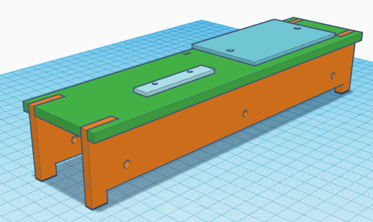
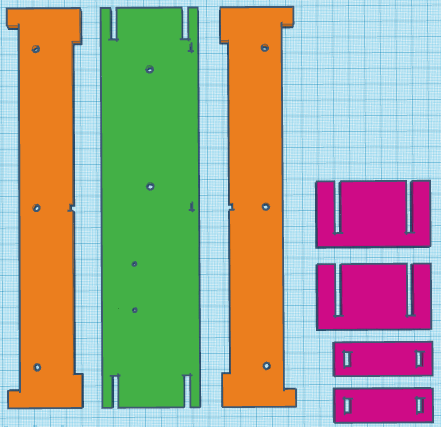
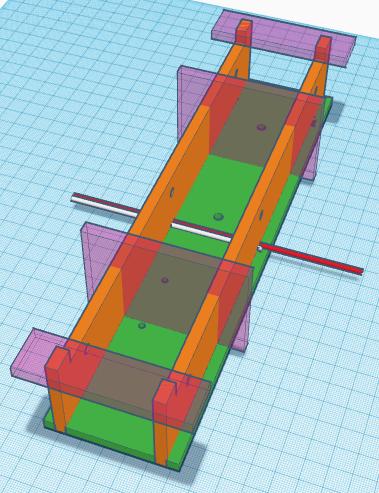

# Train Movement Measurer - The Tunnel

To hold the light gates a fixed distance apart I had some acrylic LASER cut, in order to make sure it fit together first time I actually used some 3D printing CAD software to create the parts. As a result you have the option of using either of these as a starting point for your tunnel.
The tunnel is designed to take threaded inserts to hold the stand-offs for the breadboard and LED strip. It's also designed with rectangular holes to allow for the routing of wire. In my first build these proved tight but manageable so you may want to increase their length.
All that matters is that the LED and detector of each light gate are in a straight line from each other (preferably horizontal and perpendicular to the track) and are a known fixed distance apart. You could for example choose to have the detectors and circuitry hidden in a station waiting room and the LEDs disguised as relay cabinets should you wish.

## LASER Cutting

I'd previously used [RazorLAB](https://www.razorlab.online/) for some LASER cutting so took their template (no longer available) and added in the parts - [LASER.svg](LASER.svg).
It should be noted that they cut from standard sizes of acrylic and this design uses the middle size (with wastage). It could be shrunk to a shorter tunnel in exchange for fitting on a smaller size and saving money at the loss of accuracy. I've not done that maths but suspect for smaller than OO 5cm (rather than 10cm) spacing of the light gates would suffice. Alternatively the dead space could be used for another project or the experiment this this technology. The slots are designed so that it will fit together when cut from 5mm thick material, you could shrink to using 3mm thickness but would end up with the LEDs protruding more on the inside so watch your clearance.
You should also note that they've been designed for n gauge, for a different scale you'll likely want to change the height of the sides and width of the top to ensure appropriate clearance for your trains.
You should also ensure that the holes are the right size for your threaded inserts and spacing for your breadboard and LED strip.

The tunnel is designed in 3 parts (well 2 with one duplicated) and some parts to help keep it square during construction (in purple).
The green top is designed to hold the breadboard, LED stick and keep the sides in place. It has holes for threaded inserts and for wires to pass through.
The orange sides are identical and have two large notches at the top for aligning with the top, a large cut-out along the bottom to allow them to straddle point work, circular holes for LEDs/detectors and a rectangular hole for the routing of wires.

As can be seen the purple supports will hold the sides square whilst the sides are glued to the top. The holes for the wire are quite tight so it's best to route two wires before glueing.
1. Insert the threaded inserts into the top.
2. Press the sides and top together, ensuring correct orientation.
3. Route the two wires:
    * White (colour doesn't actually matter but I'll be referring to it as white in [the electronics readme](../Electronics/README.md)) from the top, through the side, along the top inside the tunnel and out the other side.
    * Red (colour doesn't actually matter but I'll be referring to it as red in [the electronics readme](../Electronics/README.md)) from one side to the other.
4. Apply glue to the joints between the sides and top, ensuring not to accidentally glue the wires or purple supports.
5. Once the glue has sufficiently set remove the purple supports and glue and bits you had to skip over.

## 3D Printing

As mentioned above this STL file is a by-product of how I designed and test fitted the parts for LASER cutting and as such should be used at your risk.

I'm aware that the parts are larger than a typical build space it could be shrunk to a shorter tunnel in exchange for fitting on a smaller size and saving money at the loss of accuracy. I've not done that maths but suspect for smaller than OO 5cm (rather than 10cm) spacing of the light gates would suffice.
You should also note that they've been designed for n gauge, for a different scale you'll likely want to change the height of the sides and width of the top to ensure appropriate clearance for your trains.
You should also ensure that the holes are the right size for your threaded inserts and spacing for your breadboard and LED strip.

I encourage a contribution from anyone who'd like to take this STL and make a decent version for inclusion here.
[Print.stl](Print.stl)
